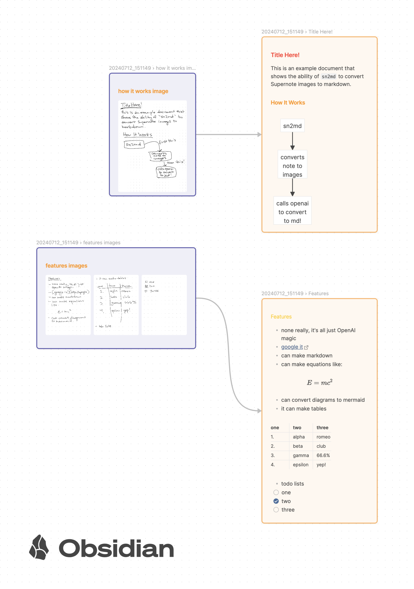

# Supernote to Markdown converter (sn2md)

**sn2md** is a command-line tool to convert Supernote `.note` files into markdown. It leverages OpenAI GPT-4o to convert images and text from Supernote files into a structured markdown document.



Sample output: [20240712_151149.md](docs/20240712_151149/20240712_151149.md)

## Features

- Converts Supernote `.note` files to markdown.
- Supports conversion of images to markdown using the Mermaid diagramming tool.
- Automatically handles math equations using `$` and `$$` style math blocks.
- Generates a markdown file and embedded images (custom output supported).

## Installation

```sh
pip install sn2md
```

Setup your **OPENAI_API_KEY** environment variable.

## Usage

To import a single Supernote `.note` file, use the `file` command:

```sh
# import one .note file:
sn2md --output <output_directory> file <path_to_note_file>

# import a directory of .note files:
sn2md --output <output_directory> directory <path_to_directory>
```

Notes:
- A cache file is also generated, so repeated runs don't recreate the same data.
  You can force a refresh by running with the `--force` flag.


## Configuration

A configuration file can be used to override the program defaults. The
default location is platform specific (eg, `~/Application Support/sn2md.toml` on OSX, `~/.config/sn2md.toml` on Linux, etc).

Values that you can override:
- template: The output template to geneerate markdown.
- prompt: The prompt sent to the OpenAI API. Requires a `{context}` placeholder
  to help the AI understand the context of the previous page.
- title_prompt: The prompt sent to the OpenAI API to decode any titles (H1-H4 highlights).
- model: The OpenAI model to use (default: `gpt-4o-mini`).
- openai_api_key: Your OpenAI API key (defaults to your `$OPENAI_API_KEY` environmental variable setting).

Example instructing the AI to convert text to pirate speak:

```toml
prompt = """###
Context (what the last couple lines of the previous page were converted to markdown):
{context}
###
Convert the following image to markdown:
- Don't convert diagrams or images. Just output "<IMAGE>" on a newline.
"""

template = """
# Pirate Speak
{{markdown}}
"""
```

### Prompt

The default prompt sent to the OpenAI API is:

```markdown
###
Context (what the last couple lines of the previous page were converted to markdown):
{context}
###
Convert the following image to markdown:
- If a diagram or image appears on the page, and is a simple diagram that the mermaid diagramming tool can achieve, create a mermaid codeblock of it.
- When it is unclear what an image is, don't output anything for it.
- Assume text is not in a codeblock. Do not wrap any text in codeblocks.
- Use $$, $ style math blocks for math equations.
```

This can be overridden in the configuration file.

### Output Template

You can provide your own [jinja template](https://jinja.palletsprojects.com/en/3.1.x/templates/#synopsis), if you prefer to customize the markdown
output. The default template is:

```jinja
---
created: {{year_month_day}}
tags: supernote
---

{{markdown}}

# Images

- 


# Keywords

- Page {{ keyword.page_number }}: {{ keyword.content }}


# Links

- Page {{ link.page_number }}: {{ link.type }} {{ link.inout }} {{ link.name }}


# Titles

- Page {{ title.page_number }}: Level {{ title.level }} "{{ title.content }}"

```

Variables supplied to the template:
- `year_month_day`: The date the note was created (eg, 2024-05-12).
- `markdown`: The markdown content of the note.
- `images`: an array of image objects with the following properties:
  - `name`: The name of the image file.
  - `rel_path`: The relative path to the image file to where the file was run
    from.
  - `abs_path`: The absolute path to the image file.
- `links`: an array of links in or out of the note with the following properties:
  - `page_number`: The page number the link is on.
  - `type`: The link type (page, file, web)
  - `name`: The basename of the link (url, page, web)
  - `device_path`: The full path of the link
  - `inout`: The direction of the link (in, out)
- `keywords`: an array of keywords with the following properties:
  - `page_number`: The page number the keyword is on.
  - `content`: The content of the keyword.
- `titles`: an array of titles with the following properties:
  - `page_number`: The page number the title is on.
  - `level`: The level of the title (1-4).
  - `content`: The content of the title. If the area of the title appears to be text, the text, otherwise a description of it.


## Contributing

Contributions are welcome. Please open an issue or submit a pull request.

### Development

```sh
git clone https://github.com/yourusername/supernote-importer.git
cd supernote-importer
poetry install
```


## License

This project is licensed under the AGPL License. See the [LICENSE](LICENSE) file for details.

## Acknowledgements

- [Supernote](https://www.supernote.com/) for their amazing note-taking devices.
- [supernote-tool library](https://github.com/jya-dev/supernote-tool) for .note file parsing.
