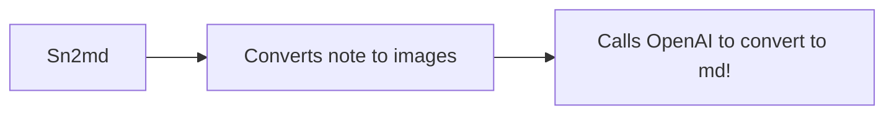

### Title Here!

This is an example document that shows the ability of `sn2md` to convert Supernote images to markdown.

### How It Works

Features

- none really, it's all just OpenAI magic
- [google it](https://google)
- can make markdown
- can make equations like:

$$
E = mc^2
$$

- can convert diagrams to mermaid
- it can make tables:

| one | two    | three  |
|-----|--------|--------|
| 1.  | alpha  | romeo  |
| 2.  | beta   | club   |
| 3.  | gamma  | 66.6%  |
| 4.  | epsilon| yep!   |

- todo lists.
- todo lists.

- [ ] one
- [x] two
- [ ] three

# Images

